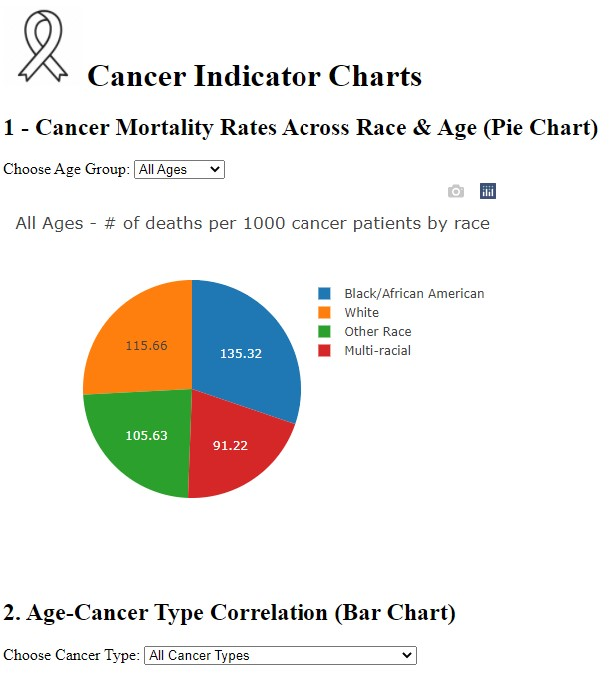
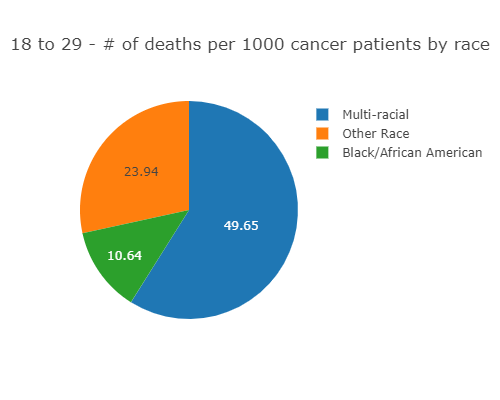
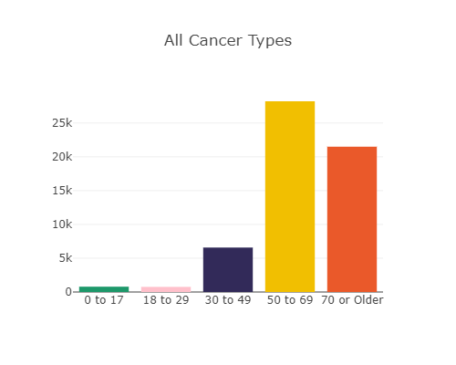
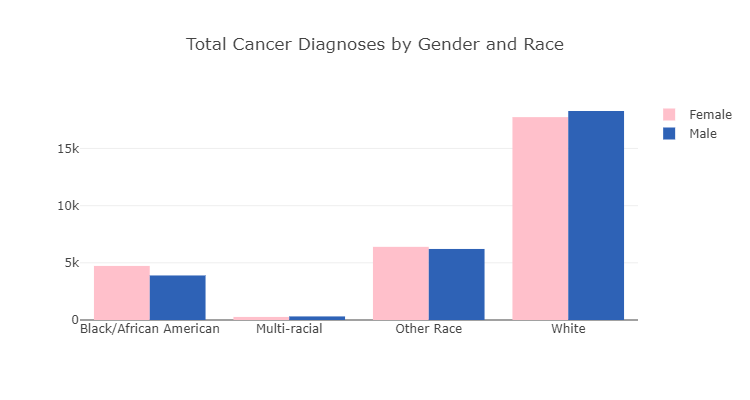
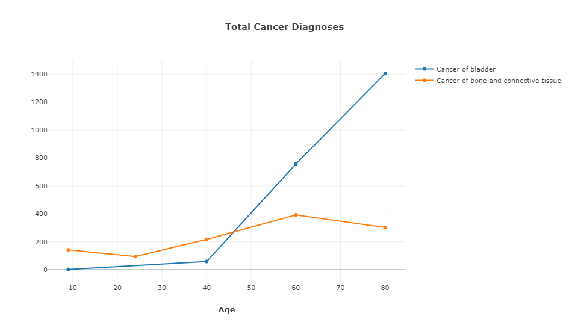

# Cancer Indicator Charts - January 2022

# Link
**[https://lancaster-cancer-charts.herokuapp.com/](https://lancaster-cancer-charts.herokuapp.com/)**

# Example Charts

# Author
 
<h3 align="center">Tom Lancaster</h3>

 Learn More: 

<a href="https://github.com/tlan2/icf-internship-challenge/blob/main/resume_thomaslancaster.pdf" target="_blank">Resume</a>
 
 
<a href="https://tlan2.github.io/portfolio/" target="_blank">Portfolio</a>
 
 
<a href="https://www.linkedin.com/in/thomasmorelancaster/" target="_blank">LinkedIn</a>

 
 

# Tools
<ol>
<li>JavaScript</li>
    <ol> 
        <li>JQuery (API calls)</li> 
        <li><a href="https://plotly.com/javascript/" target="_blank">plotly</a></li> 
    </ol>
<li>HTML</li>
<li>CSS</li>
</ol>

# Relevant Links
<ol>
<li>Assignment - <a href="https://github.com/episphere/internshipChallenge" target="_blank">NCI DCEG Internship Challenge</a></li>
<li>API Documentation - <a href="https://dev.socrata.com/foundry/health.data.ny.gov/gnzp-ekau" target="_blank">Hospital Inpatient Discharges</a></li> 
</ol>

